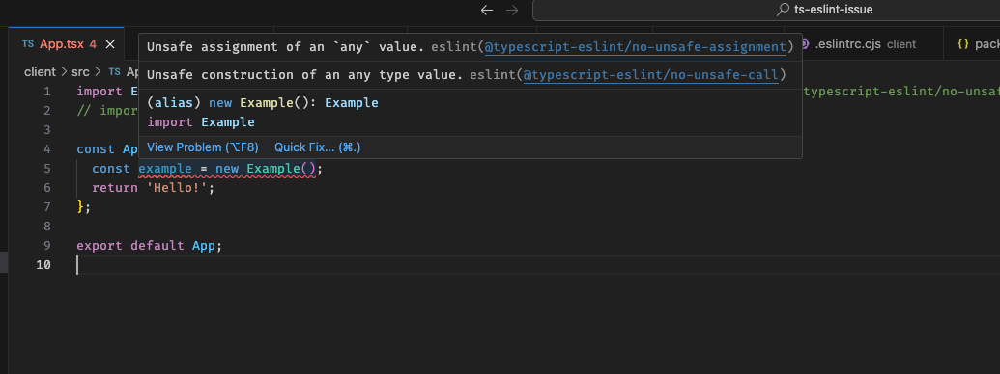

# ts-eslint-issue

In VSCode, follow setup, and navigate to client/src/App.tsx. An error appears as shown below.

## Setup

First, ensure you're running the correct Node version by running `nvm use`.

1. clone the repo
2. `yarn install`
3. `yarn lint`
